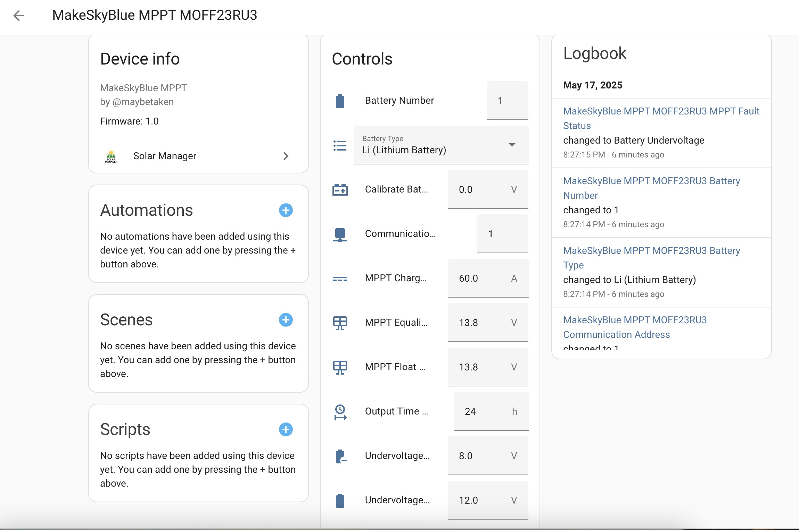
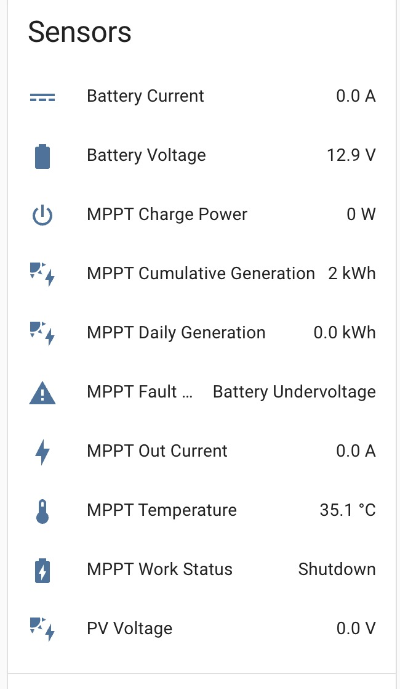
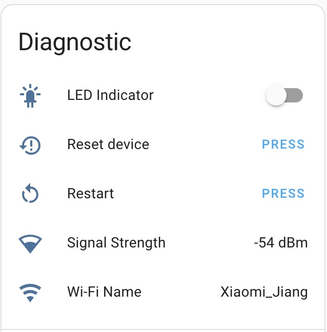

#  Solar Manager

Solar Manager is a Home Assistant integration designed to manage and monitor solar devices.
It supports multiple device protocols, providing real-time data collection, device control, and diagnostic features.

## Features

- **Device Support**: Compatible with various solar device models and protocols.
- **Real-Time Monitoring**: Provides real-time data such as device status, power, voltage, and current.
- **Remote Control**: Allows control of device switches, modes, and more via Home Assistant.
- **Diagnostics**: Offers diagnostic information like signal strength and fault status.
- **Automation Integration**: Seamlessly integrates with Home Assistant automation.

## Supported Devices

- [x] **MakeSkyBlue (每天蓝)**
- [x] **MakeSkyBlue MPPT (每天蓝 MPPT)**
- [x] **Megarevo （迈格瑞能）**
- [x] **JK BMS (极空BMS)**
- [ ] **CHINT (正泰电表)** - ongoing
- [ ] **Sungery (晟格锐)** - ongoing

## Installationion

1. Ensure the [MQTT integration](https://www.home-assistant.io/integrations/mqtt/) is installed.Ensure the [MQTT integration](https://www.home-assistant.io/integrations/mqtt/) is installed.
2. Add the Solar Manager integration to your Home Assistant configuration.
3. Follow the setup wizard to add and configure your devices.

## Usage

- Connect ESP32 device to the internet through the `ESP Config` WeChat mini-program or `EspBlufi` application. If you don't have this device, please contact me through 296496296@qq.com.
- Currently, the MQTT broker only supports HA local versions. Recommended local MQTT broker: Mosquitto.
- Set up your Home Assistant network as `host`; otherwise, your ESP32 device will not be able to connect to HA. your Home Assistant network as `host`; otherwise, your ESP32 device will not be able to connect to HA.
- Once the preparation is done, you can connect through the Serial Number.- Once the preparation is done, you can connect through the Serial Number.

**Note**: Please enter the correct Serial Number in the ESP32 device.

- If your HA doesn't support remote monitoring, please check the `Discussions` section. For users in China, you can use `贝锐花生壳`.

**If you are not familiar with the settings, please do not change them.**

## Example for MakeSkyBlue MPPT

 

## Disclaimer

This project is for educational purposes only. The data obtained from the devices may not be accurate. Any improper operation or inaccuracy that causes issues, including but not limited to device damage, explosions, fires, etc., is not the responsibility of the author. devices may not be accurate. Any improper operation or inaccuracy that causes issues, including but not limited to device damage, explosions, fires, etc., is not the responsibility of the author.
Please do not use this project for commercial purposes. Any form of disassembly, tampering, or attempts to access the contents of the ESP32 module provided by the author will be considered illegal.Please do not use this project for commercial purposes.
By installing and using the device or integration, you agree to this disclaimer. and using the device or integration, you agree to this disclaimer.

## Esp32 module
Esp32 module firmware is closed-source project, if you want this module, please contact that email.

## Support and Feedback

If you enjoy this project, consider supporting us on [Ko-fi](https://ko-fi.com/maybetaken).
For issues or suggestions, please submit them to the project's GitHub repository.For issues or suggestions, please submit them to the project's GitHub repository.
